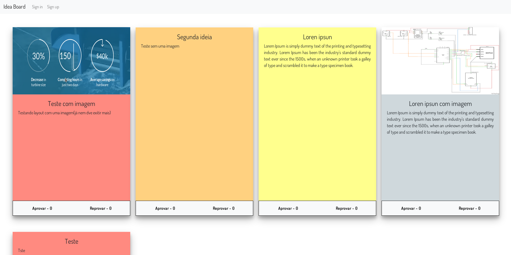

# Idea-Board

Quadro para adicionar ideias.

**- Modifiquei o projeto aṕos o envio para salvar imagem no S3 e ficar mais apresentavel no Heroku.**

Base do projeto => Project #28: Idea Board - https://medium.freecodecamp.org/every-time-you-build-a-to-do-list-app-a-puppy-dies-505b54637a5d

O que funciona:

- Sistema básico de usuario(new, update, delete);
- Ideia só pode ser apagada/editada por um usuário logado;
- Usuário pode votar(aprovado/desaprovado) para uma ideia;
- Ordem do mural com base nos upvotes;
- Adicionar imagem na ideia;

Coisas a fazer se um dia eu votar a esse projeto:

- Toda a ideia deve ser aprovada pelo adm antes de ser postada;
- Quebra de linhas no textfield;
- Opções de filtro e pesquisa;
- Número x de downvotes deleta a ideia;
- Sistema de usuário melhorado;
- Melhorar formulários(html, css)
- No caso do heroku falta um S3 pra guardar os arquivos
- Apenas quem criou pode modificar/apagar a ideia e nesse caso outros usuários podem dar um feedback(comentário);

